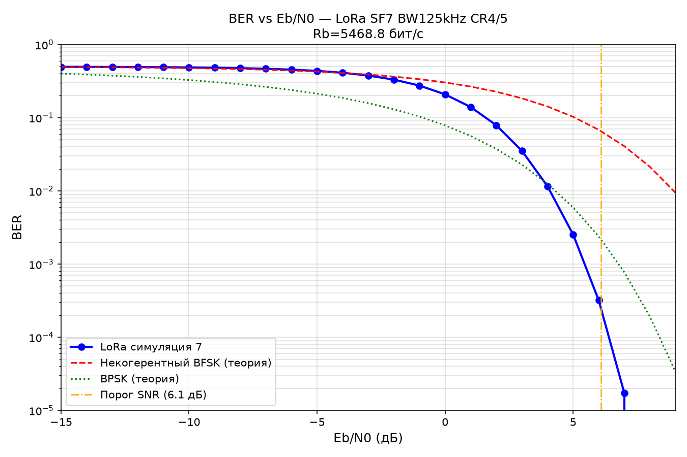
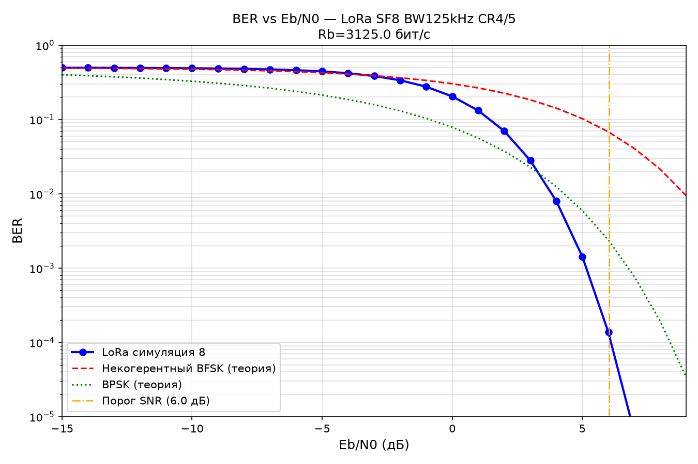
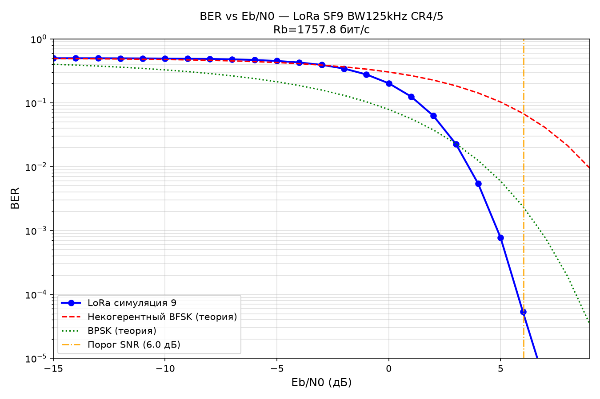
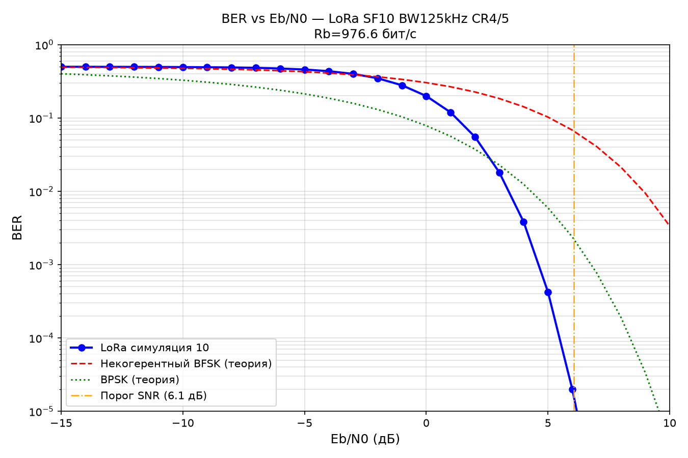
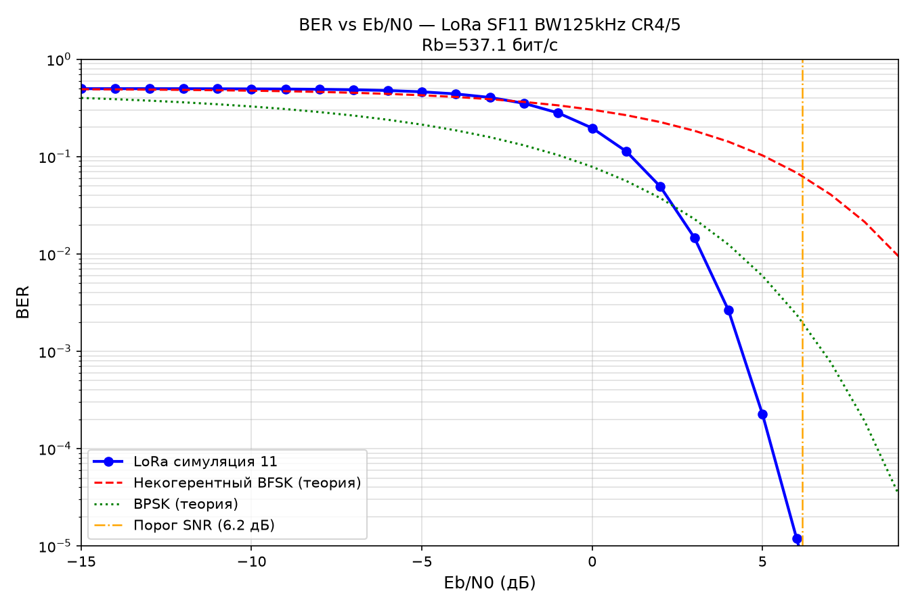

# LoRa симулятор

---

- [LoRa симулятор](#lora-симулятор)
  - [Введение](#введение)
  - [Физический уровень](#физический-уровень)
    - [Описание физического уровня](#описание-физического-уровня)
    - [Кривые BER(Eb/N0)](#кривые-berebn0)
    - [Локальный код для отладки](#локальный-код-для-отладки)
    - [Docker](#docker)
    - [Docker local](#docker-local)
    - [Docker + GNS3](#docker--gns3)
  - [Канальный уровень](#канальный-уровень)
  - [Сетевой уровень](#сетевой-уровень)

---

## Введение

Актуальность

## Физический уровень

### Описание физического уровня

Общие сведения

### Кривые BER(Eb/N0)

Чтобы построить графики, зайдите в папку **phy_new** и запустите скрипт *BER.py*.
Параметры модели настраиваются в *setup.py* и *params.py*








### Локальный код для отладки

Код для проверки находится в папке **phy_new**. Для проверки необходимо запустить скрипт *main.py*.

### Docker

**Docker** — это программная платформа для разработки, доставки и запуска приложений в изолированных средах — контейнерах. Она позволяет упаковать приложение со всем его окружением (библиотеками, системными утилитами и кодом) в единый стандартизированный блок, который гарантированно работает на любом компьютере или сервере.

[Docker](https://www.docker.com/)

[Установка Docker](https://docs.docker.com/engine/install/)

**Docker Compose** — это инструмент для запуска и одновременного управления несколькими взаимосвязанными Docker-контейнерами. Вместо того чтобы вручную прописывать команды для каждого контейнера, описывается вся структура приложения в одном файле, а затем запускает и останавливает всю систему одной командой.

[Docker Compose](https://docs.docker.com/compose/)

[Установка Docker Compose](https://docs.docker.com/compose/install/)

### Docker local

Быстрая проверка отладка осуществляется при помощи локального образа **docker_phy**.

Начало работы:

1. Зайти в ~/docker_phy
2. Собрать образ:
   ```
   sudo docker-compose up -d --build 
   ```
3. Запустить образ
   ```
   sudo docker-compose up 
   ```

### Docker + GNS3

---

## Канальный уровень

---

## Сетевой уровень